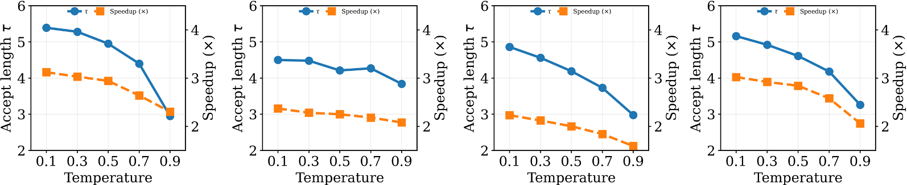
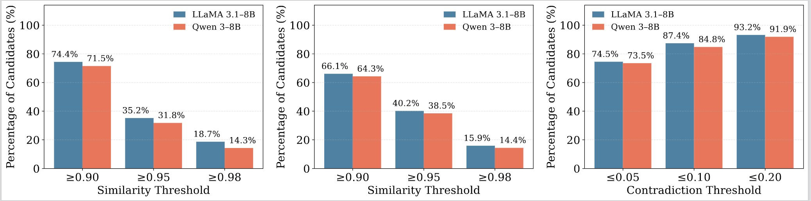
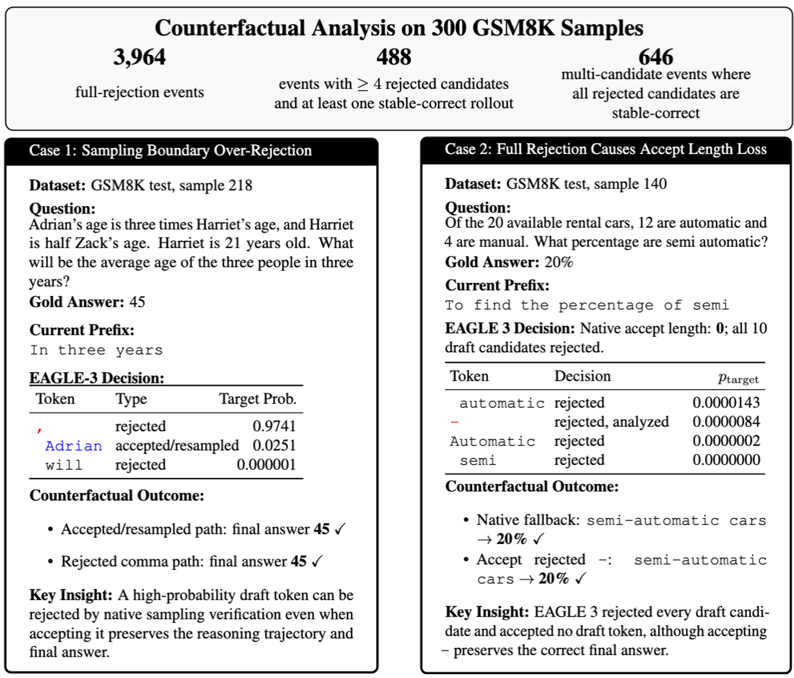
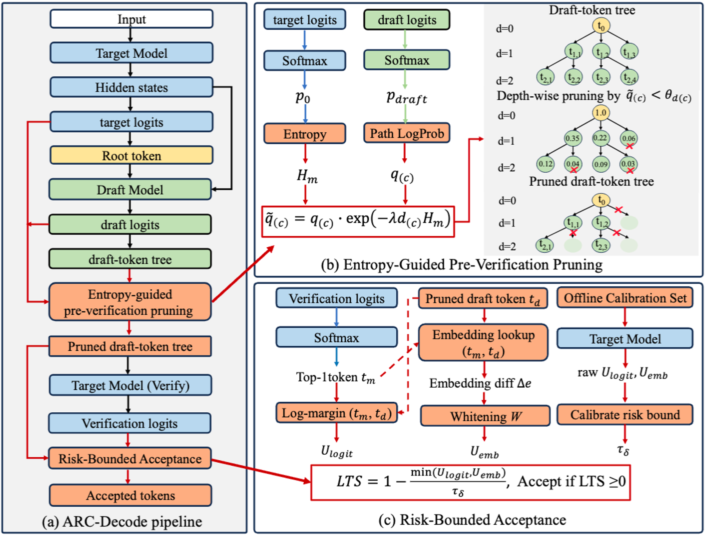
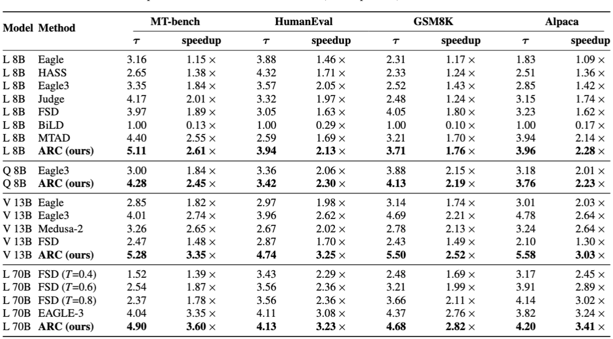

<div align="center">
  <h1>ARC-Decode: Accelerated Decoding with Risk-Bounded Acceptance</h1>

  <p>📝 This repository accompanies our <b>ICML 2026</b> paper and hosts the official code release.</p>

  <p>
    <b>Ying Li</b><sup>1</sup>, <b>Zhaode Wang</b><sup>2</sup>, <b>Zhiwen Chen</b><sup>2</sup>, <b>Chengfei Lv</b><sup>2</sup>, <b>Huan Wang</b><sup>1</sup>
  </p>
  <p>
    <sup>1</sup>Westlake University &nbsp;&nbsp;·&nbsp;&nbsp; <sup>2</sup>Alibaba Group
  </p>

  

  <p>
    <a href="https://icml.cc/virtual/2026/poster/66788">
      
    </a>
    &nbsp;
    <a href="https://neuraliying.github.io/ARC-Decode/">
      
    </a>
    &nbsp;
    <a href="https://opensource.org/license/apache-2-0">
      
    </a>
  </p>
</div>

---

## 📰 News

- **[2026-07-03]** 🔥 Code is released.
- **[2026-05-01]** 🎉 ARC-Decode is accepted to ICML 2026 as a poster.

## Overview

ARC-Decode (Acceptance with Risk Control) is a training-free speculative decoding method that accelerates generation **under sampling** by extending acceptance under bounded risk, on top of off-the-shelf EAGLE-3.

### Background

<p align="center">
  
</p>

**Why Does Speculative Decoding Slow Down under Sampling?**

**Key Problem.** EAGLE-3 exhibits significant degradation in decoding efficiency under sampling, with performance further deteriorating as temperature increases, leading to reduced acceptance length in speculative decoding.

### Motivation

**Are the rejected tokens under sampling actually harmful?**

<p align="center">
  
</p>

**Observation 1.** Many rejected drafts yield highly consistent continuations under multiple surrogate semantic metrics, suggesting that token-level rejection does not necessarily imply a downstream change.

<p align="center">
  
</p>

**Observation 2.** Counterfactual rollouts reveal substantial recoverable acceptance space: many full-rejection events contain rejected draft candidates that still preserve the correct final answer.

**Key insight.** Under sampling, posterior rejection sampling can reject draft candidates that would still preserve the reasoning trajectory and final answer, revealing additional acceptance space that can be exploited under bounded risk.

### Method

<p align="center">
  
</p>

1. **Entropy-guided pruning reduces verification cost.** Draft nodes are ranked by path probability, target entropy, and depth to form a compact prefix-closed subtree.
2. **Local shift estimation finds low-risk relaxation opportunities.** For rejected tokens, ARC-Decode combines target logit margin and whitened embedding distance to estimate local distribution shift.
3. **Risk-bounded acceptance extends accepted sequences.** A calibrated Local Tolerance Score selectively relaxes low-shift rejections while retaining standard posterior acceptance as the floor.

**Summary.** Training-free, plug-and-play, and free of extra target forward passes.

### Results

Full-data results on NVIDIA A100 GPUs with `temperature=1.0`. Speculative decoding uses `total_tokens=60` and `depth=7`. Throughput is computed from actual model-generated tokens divided by end-to-end latency. Each benchmark reports accept length, throughput (tok/s), and speedup (`method throughput / Base throughput`). Best results are in **bold**.

#### Llama 8B

| method | MT-Bench accept | MT-Bench throughput | MT-Bench speedup | HumanEval accept | HumanEval throughput | HumanEval speedup | GSM8K accept | GSM8K throughput | GSM8K speedup | Alpaca accept | Alpaca throughput | Alpaca speedup |
|---|---|---:|---:|---:|---:|---:|---:|---:|---:|---:|---:|---:|
| Base | 1.000 | 33.093 | 1.00x | 1.000 | 31.550 | 1.00x | 1.000 | 31.964 | 1.00x | 1.000 | 32.078 | 1.00x |
| Eagle-3 base | 3.121 | 66.099 | 2.00x | 4.529 | 90.712 | 2.88x | 5.184 | 108.828 | 3.40x | 5.054 | 105.546 | 3.29x |
| **ARC (Ours)** | **6.324** | **131.062** | **3.96x** | **5.115** | **93.581** | **2.97x** | **6.648** | **125.713** | **3.93x** | **6.223** | **125.667** | **3.92x** |

#### Qwen 8B

| method | MT-Bench accept | MT-Bench throughput | MT-Bench speedup | HumanEval accept | HumanEval throughput | HumanEval speedup | GSM8K accept | GSM8K throughput | GSM8K speedup | Alpaca accept | Alpaca throughput | Alpaca speedup |
|---|---|---:|---:|---:|---:|---:|---:|---:|---:|---:|---:|---:|
| Base | 1.000 | 27.597 | 1.00x | 1.000 | 27.206 | 1.00x | 1.000 | 27.614 | 1.00x | 1.000 | 27.937 | 1.00x |
| Eagle-3 base | 4.046 | 78.610 | 2.85x | 4.170 | 71.741 | 2.64x | 5.367 | 92.632 | 3.35x | 4.444 | 81.025 | 2.90x |
| **ARC (Ours)** | **4.978** | **95.246** | **3.45x** | **4.232** | **76.058** | **2.80x** | **5.782** | **96.850** | **3.51x** | **5.008** | **92.196** | **3.30x** |

#### Vicuna 13B

| method | MT-Bench accept | MT-Bench throughput | MT-Bench speedup | HumanEval accept | HumanEval throughput | HumanEval speedup | GSM8K accept | GSM8K throughput | GSM8K speedup | Alpaca accept | Alpaca throughput | Alpaca speedup |
|---|---|---:|---:|---:|---:|---:|---:|---:|---:|---:|---:|---:|
| Base | 1.000 | 29.155 | 1.00x | 1.000 | 28.363 | 1.00x | 1.000 | 30.109 | 1.00x | 1.000 | 30.127 | 1.00x |
| Eagle-3 base | 5.354 | 106.458 | 3.65x | 5.656 | 102.363 | 3.61x | 5.731 | 117.032 | 3.89x | 5.228 | 99.424 | 3.30x |
| **ARC (Ours)** | **6.880** | **134.596** | **4.62x** | **6.905** | **131.057** | **4.62x** | **6.796** | **126.542** | **4.20x** | **6.582** | **131.506** | **4.37x** |

**Quality.** HumanEval reports pass@10; GSM8K reports exact match. Best results are in **bold**.

<div align="center">
<table>
  <tr>
    <td>
      <table>
        <tr><th colspan="3">llama</th></tr>
        <tr><th>method</th><th>humaneval</th><th>gsm8k</th></tr>
        <tr><td>Base</td><td align="right">0.6037</td><td align="right"><b>0.7125</b></td></tr>
        <tr><td>Eagle-3 base</td><td align="right">0.5549</td><td align="right">0.6375</td></tr>
        <tr><td>ARC (Ours)</td><td align="right"><b>0.7439</b></td><td align="right">0.7074</td></tr>
      </table>
    </td>
    <td>
      <table>
        <tr><th colspan="3">qwen</th></tr>
        <tr><th>method</th><th>humaneval</th><th>gsm8k</th></tr>
        <tr><td>Base</td><td align="right"><b>0.8537</b></td><td align="right">0.7875</td></tr>
        <tr><td>Eagle-3 base</td><td align="right"><b>0.8537</b></td><td align="right">0.8125</td></tr>
        <tr><td>ARC (Ours)</td><td align="right"><b>0.8537</b></td><td align="right"><b>0.8211</b></td></tr>
      </table>
    </td>
    <td>
      <table>
        <tr><th colspan="3">vicuna</th></tr>
        <tr><th>method</th><th>humaneval</th><th>gsm8k</th></tr>
        <tr><td>Base</td><td align="right">0.1220</td><td align="right">0.1625</td></tr>
        <tr><td>Eagle-3 base</td><td align="right">0.1159</td><td align="right">0.1625</td></tr>
        <tr><td>ARC (Ours)</td><td align="right"><b>0.2744</b></td><td align="right"><b>0.1971</b></td></tr>
      </table>
    </td>
  </tr>
</table>
</div>

---

<p align="center">
  
</p>
<p align="center"><i>Additional efficiency results on a single NVIDIA A6000 GPU (<code>total_tokens=32</code>, <code>depth=6</code>).</i></p>

## Implementation

### Setup

```bash
pip install -r requirements.txt
```

Dependencies: `accelerate`, `huggingface_hub`, `numpy`, `sentencepiece`, `torch`, `transformers`. The release scripts run with `temperature=1.0`; Qwen uses no-thinking mode.

### Project Layout

```text
ARC_Decode_release/
  model/                         # ARC-Decode model and verification code
  evaluation/
    arc_total_depth_eval.py       # Unified benchmark runner
    arc_lts_calibrate.py          # LTS calibration runner
    calibration/                  # Calibrated LTS parameter files
  data/
    mt_bench/question.jsonl
    humaneval/humaneval_official.jsonl
    gsm8k/full_question.jsonl
    alpaca/full_question.jsonl
  scripts/
    run_arc_eval.sh               # One benchmark run
    run_calibration.sh            # LTS calibration
```

### Model Paths

Set the local model paths with environment variables, or edit `MODEL_SPECS` in `evaluation/arc_total_depth_eval.py` and `evaluation/arc_lts_calibrate.py`.

#### Target models

The target model is the large language model being accelerated (the verifier).

| model | local path (env var) | public source |
|---|---|---|
| Llama-3.1-8B-Instruct | `ARC_LLAMA_BASE` | [meta-llama/Llama-3.1-8B-Instruct](https://huggingface.co/meta-llama/Llama-3.1-8B-Instruct) |
| Qwen3-8B | `ARC_QWEN_BASE` | [Qwen/Qwen3-8B](https://huggingface.co/Qwen/Qwen3-8B) |
| Vicuna-13B-v1.3 | `ARC_VICUNA_BASE` | [lmsys/vicuna-13b-v1.3](https://huggingface.co/lmsys/vicuna-13b-v1.3) |

#### Draft models

The draft model is the lightweight EAGLE-3 head that proposes candidate tokens. ARC-Decode is training-free and uses the public EAGLE-3 checkpoints unchanged.

| draft for | local path (env var) | public source |
|---|---|---|
| Llama-3.1-8B | `ARC_LLAMA_DRAFT` | [yuhuili/EAGLE3-LLaMA3.1-Instruct-8B](https://huggingface.co/yuhuili/EAGLE3-LLaMA3.1-Instruct-8B) |
| Qwen3-8B | `ARC_QWEN_DRAFT` | [Tengyunw/qwen3_8b_eagle3](https://huggingface.co/Tengyunw/qwen3_8b_eagle3) |
| Vicuna-13B-v1.3 | `ARC_VICUNA_DRAFT` | [yuhuili/EAGLE3-Vicuna1.3-13B](https://huggingface.co/yuhuili/EAGLE3-Vicuna1.3-13B) |

## Calibration

Calibrate LTS parameters before evaluation if the checkpoint files in `evaluation/calibration/` are absent or need to be regenerated.

```bash
CUDA_VISIBLE_DEVICES=0 bash scripts/run_calibration.sh llama
CUDA_VISIBLE_DEVICES=0 bash scripts/run_calibration.sh qwen
CUDA_VISIBLE_DEVICES=0 bash scripts/run_calibration.sh vicuna
```

The default output path is:

```text
evaluation/calibration/lts_<model>_params_t_1.pt
```

## Evaluation

Run one model and benchmark:

```bash
CUDA_VISIBLE_DEVICES=0 bash scripts/run_arc_eval.sh llama mt_bench 60 7
CUDA_VISIBLE_DEVICES=0 bash scripts/run_arc_eval.sh llama humaneval 60 7
CUDA_VISIBLE_DEVICES=0 bash scripts/run_arc_eval.sh llama gsm8k 60 7
CUDA_VISIBLE_DEVICES=0 bash scripts/run_arc_eval.sh llama alpaca 60 7
```

Replace `llama` with `qwen` or `vicuna`, and replace the benchmark with one of:

```text
mt_bench, humaneval, gsm8k, alpaca
```

The optional fifth argument sets the output directory:

```bash
CUDA_VISIBLE_DEVICES=0 bash scripts/run_arc_eval.sh qwen gsm8k 60 7 results/arc/qwen/gsm8k/tt60_d7
```

Each run writes:

```text
generations.jsonl
stats.json
```

## 🙏 Acknowledgements

This project builds upon [EAGLE / EAGLE-3](https://github.com/SafeAILab/EAGLE). We sincerely thank the EAGLE authors for their excellent work and for openly releasing the draft models that ARC-Decode builds on.

## Citation

If you find this work useful, please cite:

```bibtex
@inproceedings{li2026arcdecode,
  title     = {ARC-Decode: Accelerated Decoding with Risk-Bounded Acceptance},
  author    = {Li, Ying and Wang, Zhaode and Chen, Zhiwen and Lv, Chengfei and Wang, Huan},
  booktitle = {ICML},
  year      = {2026}
}
```
